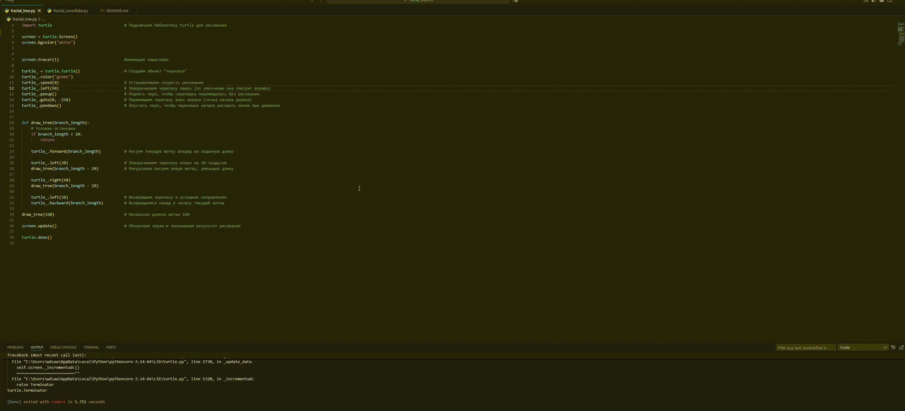
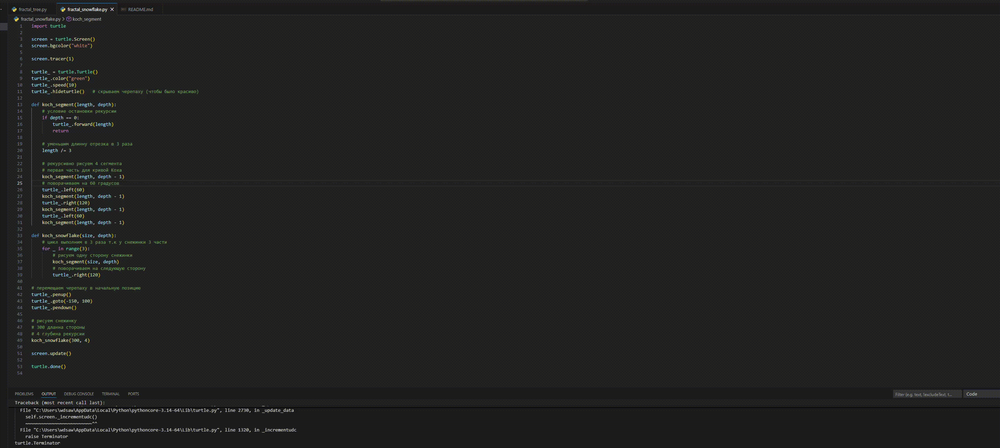
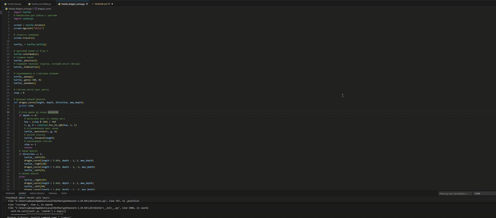

Fractal Tree (Python Turtle)

Данный проект демонстрирует создание фрактальныъ изображений 
с использованием стандартной библиотеки turtle и colorsys для цвета языка Python.

Используемые технологии

- Python 
- Библиотека turtle (встроена в Python) и colorsys для цвета
- Среда разработки: VS Code

В репозитории представлены:
- фрактальное дерево
- снежинка Коха
- кривая дракона

fractal_tree.py — Фрактальное дерево
В данном файле реализовано построение фрактального дерева с помощью рекурсивной функции.

- Рисуется основная ветка заданной длины
- Из конца ветки рекурсивно рисуются две более короткие ветки
- Каждая рекурсия уменьшает длину ветки
- Процесс останавливается, когда длина ветки становится слишком маленькой

Видео с работой

fractal_snowflake.py — Снежинка Коха
В этом файле реализована снежинка Коха

- Каждый отрезок делится на три части
- Средняя часть заменяется ломаной линией из четырёх сегментов
- Процесс повторяется рекурсивно заданное количество раз
- Снежинка формируется из трёх таких сторон, повернутых на 120 градусов

Видео с работой

fractal_dragon_curve.py - Кривая Дракона
В данном файле реализовано построение кривой Дракона с использованием рекурсии

- Линия рекурсивно делится на два сегмента
- Каждый сегмент поворачивается на 45 градусов
- Направление поворота меняется на каждом уровне рекурсии
- Цвет линии изменяется для каждого сегмента, создавая градиентный эффект
- Глубина рекурсии определяет сложность и форму кривой

Видео с работой

